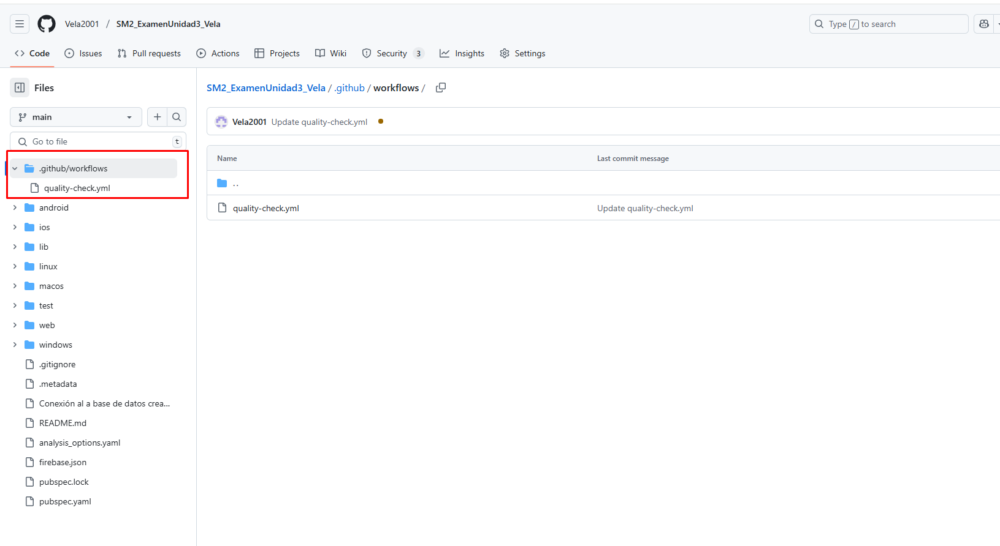
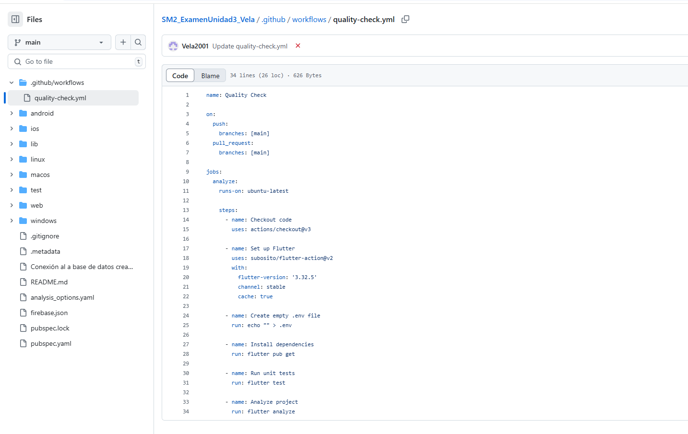
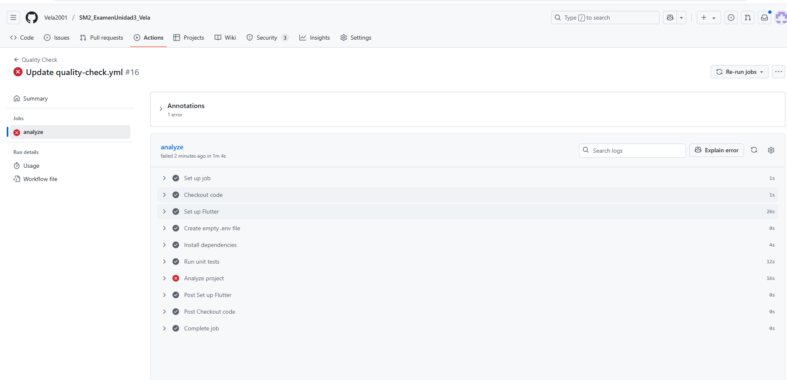
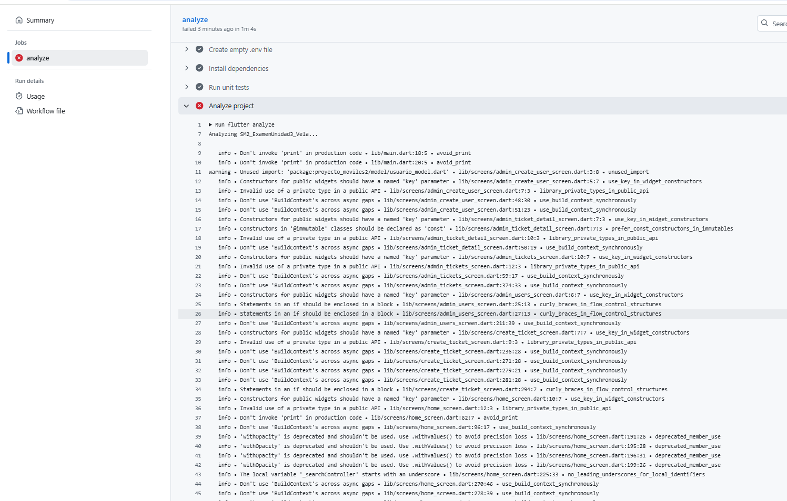
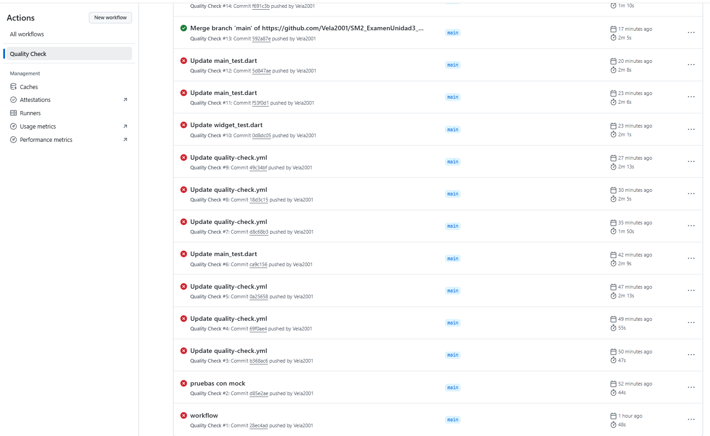

### Información de entrega

**Nombre del curso:** Soluciones Móviles II  
**Fecha:** 27/06/2025  
**Nombre Completo:** Abraham Jesús Vela Vargas  
**URL del repositorio:** [https://github.com/Vela2001/SM2_ExamenUnidad3_Vela](https://github.com/Vela2001/SM2_ExamenUnidad3_Vela)

# 📱 Aplicativo Móvil de Gestión de Tickets de Soporte - MDP

Este proyecto corresponde al desarrollo de una solución tecnológica orientada a mejorar la gestión de solicitudes técnicas dentro de la **Municipalidad Distrital de Pocollay (MDP)**. Se trata de una aplicación móvil multiplataforma desarrollada con **Flutter** y respaldada por **Firebase**, enfocada en optimizar el registro, seguimiento y resolución de incidencias internas.

---

## 🎯 Objetivo General

Diseñar e implementar un sistema móvil que permita gestionar de forma centralizada y eficiente los tickets de soporte técnico reportados por el personal de la MDP, asegurando mayor trazabilidad, rapidez en la atención y calidad del servicio.

---

## ✅ Funcionalidades Principales

- Autenticación de usuarios y administradores.
- Registro de tickets por parte de los empleados municipales.
- Seguimiento del estado de los tickets y notificaciones automáticas.
- Panel administrativo para gestión, priorización y cierre de incidencias.
- Generación de reportes y estadísticas de atención.
- Exportación de tickets en PDF.

---

## 🧑‍💻 Tecnologías Utilizadas

| Componente        | Herramienta / Tecnología      |
|-------------------|-------------------------------|
| Framework         | Flutter (Dart)                |
| Backend & Auth    | Firebase Authentication       |
| Base de Datos     | Firebase Firestore (NoSQL)    |
| Notificaciones    | Firebase Cloud Messaging      |
| Control de versiones | Git + GitHub               |
| IDE               | Android Studio / VS Code      |

---

## 🧠 Arquitectura del Sistema

El sistema sigue un enfoque **cliente-servidor** con una arquitectura modular que favorece la escalabilidad y el mantenimiento. Entre sus principales componentes se incluyen:

- **Frontend:** Interfaz gráfica intuitiva y responsiva.
- **Backend:** Gestión de lógica de negocio y validaciones.
- **Base de Datos:** Almacenamiento estructurado en Firestore.
- **Notificaciones:** Envío en tiempo real sobre el estado del ticket.

---

## 📌 Público Objetivo

- **Usuarios Generales:** Empleados de la MDP que reportan incidencias.
- **Administradores:** Personal del área de TI encargado de gestionar tickets, usuarios y estadísticas del sistema.

---

## 📦 Alcance

- Funciona en dispositivos móviles Android y navegadores web como PWA.
- No contempla integración con sistemas externos en esta versión.
- Enfoque inicial en soporte técnico interno de la municipalidad.

---

## 🔐 Seguridad

- Acceso basado en roles (RBAC).
- Validaciones en formularios.
- Control de acceso mediante autenticación Firebase.
- Cumplimiento con la Ley de Protección de Datos Personales (N.º 29733).

---

## 📊 Impacto Esperado

- Reducción del tiempo promedio de atención en un 25%.
- Incremento de eficiencia operativa en un 30%.
- Mejora significativa en la trazabilidad y satisfacción de usuarios internos.

---

### Estructura de carpetas `.github/workflows/`

A continuación se muestra la estructura de carpetas y archivos dentro de `.github/workflows/`:

### Contenido del archivo `quality-check.yml`

## Análisis de la Ejecución del Workflow (sc3.png)

La imagen muestra los resultados de una ejecución del workflow `quality-check.yml` en GitHub Actions, donde se identificó un error:

- **Estado general:** El job "analyze" falló hace 2 minutos.
- **Ubicación del error:** Línea 6 del workflow.
- **Problema detectado:** Hay un error en el paso "Set up Dutter" (posiblemente un typo de "Flutter").
- **Pasos ejecutados:** A pesar del error, el workflow completó todas las etapas incluyendo checkout, instalación de dependencias, ejecución de tests y análisis.

**Acciones recomendadas:**
1. Verificar la ortografía de "Flutter" en el archivo YAML.
2. Revisar la línea 6 del workflow para corregir la configuración.
3. Asegurar que la versión de Flutter especificada es compatible con el proyecto.

## Resultados del Análisis de Calidad

El análisis de código (`flutter analyze`) detectó **72 problemas** en el proyecto:

- **Errores:** 1 (falló el proceso)
- **Advertencias (warnings):** 19 (incluyen imports no usados, variables no utilizadas y comparaciones innecesarias)
- **Recomendaciones (info):** 52 (problemas de estilo, uso de `BuildContext` en async, parámetros `key` faltantes, etc.)

**Problemas principales:**
1. Uso de `print()` en código de producción (`avoid_print`)
2. Uso de tipos privados en APIs públicas
3. Falta de parámetros `key` en widgets públicos
4. Uso de `BuildContext` en operaciones asíncronas (riesgo de memory leaks)
5. Métodos deprecados (`withOpacity`)

**Acción requerida:**  
Corregir estos problemas para mejorar la calidad y mantenibilidad del código. El workflow fallará hasta que se resuelva al menos el error crítico.

